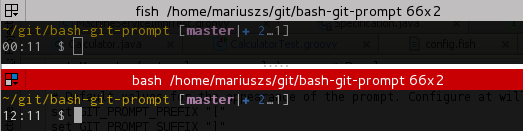

# Informative git prompt for bash and fish

[](https://gitter.im/magicmonty/bash-git-prompt?utm_source=badge&utm_medium=badge&utm_campaign=pr-badge)

This prompt is a port of the "Informative git prompt for zsh" which you can
find [here](https://github.com/olivierverdier/zsh-git-prompt)

A ``bash`` prompt that displays information about the current git repository.
In particular the branch name, difference with remote branch, number of files
staged, changed, etc.

(an original idea from this [blog post][]).

`gitstatus.sh` and `git-prompt-help.sh` added by [AKS](http://github.com/aks).

# ATTENTION! Breaking changes!

**If you use this prompt already, please update your `.git-prompt-colors.sh`,
if you have one. It now contains a function named `define_git_prompt_colors()` or `override_git_prompt_colors()`!**

**Please see the ``Custom.bgptemplate`` in the ``themes`` subdirectory of the installation directory!**

**You can now also use the function `override_git_prompt_colors()`. It should define the variable `GIT_PROMPT_THEME_NAME`
and call the function `reload_git_prompt_colors <ThemeName>` like follows:**

```sh
override_git_prompt_colors() {
  GIT_PROMPT_THEME_NAME="Custom" # needed for reload optimization, should be unique

  # Place your overrides here
  ...
}

# load the theme
reload_git_prompt_colors "Custom"
```

The advantage of this approach is, that you only need to specify the parts, that are different to the Default theme.

---

**The variable `GIT_PROMPT_SHOW_LAST_COMMAND_INDICATOR` was replaced with a more general placeholder
named ``_LAST_COMMAND_INDICATOR_``, which is replaced by the state of the last executed command. It is now activated by default.**

## Examples

The prompt may look like the following:



* ``(master↑3|✚1)``: on branch ``master``, ahead of remote by 3 commits, 1 file changed but not staged
* ``(status|●2)``: on branch ``status``, 2 files staged
* ``(master|✚7…)``: on branch ``master``, 7 files changed, some files untracked
* ``(master|✖2✚3)``: on branch ``master``, 2 conflicts, 3 files changed
* ``(master|⚑2)``: on branch ``master``, 2 stash entries
* ``(experimental↓2↑3|✔)``: on branch ``experimental``; your branch has diverged by 3 commits, remote by 2 commits; the repository is otherwise clean
* ``(:70c2952|✔)``: not on any branch; parent commit has hash ``70c2952``; the repository is otherwise clean

##  Prompt Structure

By default, the general appearance of the prompt is::

    (<branch> <upstream branch> <branch tracking>|<local status>)

The symbols are as follows:

- Local Status Symbols
  - ``✔``: repository clean
  - ``●n``: there are ``n`` staged files
  - ``✖n``: there are ``n`` files with merge conflicts
  - ``✖-n``: there are ``n`` staged files waiting for removal
  - ``✚n``: there are ``n`` changed but *unstaged* files
  - ``…n``: there are ``n`` untracked files
  - ``⚑n``: there are ``n`` stash entries
- Upstream branch
  - Shows the remote tracking branch
  - Disabled by default
  - Enable by setting GIT_PROMPT_SHOW_UPSTREAM=1
- Branch Tracking Symbols
  - ``↑n``: ahead of remote by ``n`` commits
  - ``↓n``: behind remote by ``n`` commits
  - ``↓m↑n``: branches diverged, other by ``m`` commits, yours by ``n`` commits
  - ``L``: local branch, not remotely tracked
- Branch Symbol:<br />
  	When the branch name starts with a colon ``:``, it means it's actually a hash, not a branch (although it should be pretty clear, unless you name your branches like hashes :-)

## Installation

### via [Homebrew][homebrew] on Mac OS X

- Run `brew update`

- Run `brew install bash-git-prompt` for the last stable release or `brew install --HEAD bash-git-prompt` for the
   latest version directly from the repository

- Now you can source the file in your `~/.bash_profile` as follows:

```sh
if [ -f "$(brew --prefix)/opt/bash-git-prompt/share/gitprompt.sh" ]; then
  __GIT_PROMPT_DIR=$(brew --prefix)/opt/bash-git-prompt/share
  GIT_PROMPT_ONLY_IN_REPO=1
  source "$(brew --prefix)/opt/bash-git-prompt/share/gitprompt.sh"
fi
```

### via Git clone

- Clone this repository to your home directory.

```sh
git clone https://github.com/magicmonty/bash-git-prompt.git ~/.bash-git-prompt --depth=1
```

Add to the `~/.bashrc`:
```
if [ -f "$HOME/.bash-git-prompt/gitprompt.sh" ]; then
    GIT_PROMPT_ONLY_IN_REPO=1
    source $HOME/.bash-git-prompt/gitprompt.sh
fi
```

### install for the fish shell

- If you cloned the repo to a directory other then ~/.bash-git-prompt , set __GIT_PROMPT_DIR in ~/.config/fish/config.fish
   to that path

- To install as an option in the fish_config GUI

```sh
sudo install -m 666 gitprompt.fish /usr/share/fish/tools/web_config/sample_prompts/
fish_config
```
   to install the bash-git-prompt as a choice under the prompt tab of the web config. Selecting this will copy it to
   ~/.config/fish/functions/fish_prompt.fish

- You can also do

```sh
mkdir -p ~/.config/fish/functions/
cp gitprompt.fish ~/.config/fish/functions/fish_prompt.fish
```
   to overwrite the current prompt with the bash-git-prompt directly


### All configs for .bashrc

```sh

   # Set config variables first
   GIT_PROMPT_ONLY_IN_REPO=1

   # GIT_PROMPT_FETCH_REMOTE_STATUS=0   # uncomment to avoid fetching remote status
   # GIT_PROMPT_IGNORE_SUBMODULES=1 # uncomment to avoid searching for changed files in submodules
   # GIT_PROMPT_WITH_VIRTUAL_ENV=0 # uncomment to avoid setting virtual environment infos for node/python/conda environments

   # GIT_PROMPT_SHOW_UPSTREAM=1 # uncomment to show upstream tracking branch
   # GIT_PROMPT_SHOW_UNTRACKED_FILES=normal # can be no, normal or all; determines counting of untracked files

   # GIT_PROMPT_SHOW_CHANGED_FILES_COUNT=0 # uncomment to avoid printing the number of changed files

   # GIT_PROMPT_STATUS_COMMAND=gitstatus_pre-1.7.10.sh # uncomment to support Git older than 1.7.10

   # GIT_PROMPT_START=...    # uncomment for custom prompt start sequence
   # GIT_PROMPT_END=...      # uncomment for custom prompt end sequence

   # as last entry source the gitprompt script
   # GIT_PROMPT_THEME=Custom # use custom theme specified in file GIT_PROMPT_THEME_FILE (default ~/.git-prompt-colors.sh)
   # GIT_PROMPT_THEME_FILE=~/.git-prompt-colors.sh
   # GIT_PROMPT_THEME=Solarized # use theme optimized for solarized color scheme
   source ~/.bash-git-prompt/gitprompt.sh
```

You can set the `GIT_PROMPT_SHOW_UNTRACKED_FILES` variable to `no` or `normal` to speed things up if you have lots of
untracked files in your repository. This can be the case for build systems that put their build artifacts in
the subdirectory structure of the git repository. Setting it to `all` will count all untracked files, including files
listed in .gitignore.

- `cd` to a git repository and test it!

#### Themes

The most settings are now stored in theme files. To select a theme, set the variable `GIT_PROMPT_THEME` to the name
of the theme located in `<INSTALLDIR>/themes` without the extension `.bgptheme` like this:

```sh
GIT_PROMPT_THEME=Solarized
```

If you set `GIT_PROMPT_THEME` to `Custom`, then the `.git-prompt-colors.sh` in the home directory will be used.
This file can now be generated with the command `git_prompt_make_custom_theme [<Name of base theme>]`. If the name of
the base theme is ommitted or the theme file is not found, then the Default theme is used. If you have already a custom
`.git-prompt-colors.sh` in your home directory, a error message will be shown.

You can display a list of available themes with `git_prompt_list_themes` (the current theme is highlighted)

**If you omit the `GIT_PROMPT_THEME` variable, the Default theme is used or, if you have a custom `.git-prompt-colors.sh`
in your home directory, then the Custom theme is used.**

##### Ubuntu Themes

Ubuntu requires a bit more spacing for some characters so it has its own themes.

These can be listed with `git_prompt_list_themes`:
```sh
git_prompt_list_themes | grep Ubuntu
```

##### Theme structure

Please see the ``Custom.bgptemplate`` in the ``themes`` subdirectory of the installation directory!

A theme consists of a function `override_git_prompt_colors()` which defines at least the variable `GIT_PROMPT_THEME_NAME`
 with a unique theme identifier and a call to the function `reload_git_prompt_colors <ThemeName>` like follows:

```sh
override_git_prompt_colors() {
  GIT_PROMPT_THEME_NAME="Custom" # needed for reload optimization, should be unique

  # Place your overrides here
  ...
}

# load the theme
reload_git_prompt_colors "Custom"
```

The advantage of this approach is, that you only need to specify the parts, that are different to the Default theme.

If you use a custom theme in `.git-prompt-colors.sh`, please set `GIT_PROMPT_THEME_NAME="Custom"`.

#### Further customizations

- You can define `GIT_PROMPT_START` and `GIT_PROMPT_END` to tweak your prompt.

- The default colors are defined within `prompt-colors.sh`, which is sourced by
  `gitprompt.sh`.  The colors used for various git status are defined in
  `themes/Default.bgptheme`.  Both of these files may be overridden by copying
  them to $HOME with a `.` prefix.  They can also be placed in `$HOME/lib`
  without the leading `.`.  The defaults are the original files in the
  `~/.bash-git-prompt` directory.

- You can use `GIT_PROMPT_START_USER`, `GIT_PROMPT_START_ROOT`,
  `GIT_PROMPT_END_USER` and `GIT_PROMPT_END_ROOT` in your
  `.git-prompt-colors.sh` to tweak your prompt. You can also override the start
  and end of the prompt by setting `GIT_PROMPT_START` and `GIT_PROMPT_END`
  before you source the `gitprompt.sh`.

- The current git repo information is obtained by the script `gitstatus.sh`.
- You can define `prompt_callback` function to tweak your prompt dynamically.

```sh
function prompt_callback {
    if [ `jobs | wc -l` -ne 0 ]; then
        echo -n " jobs:\j"
    fi
}
```

- There are two helper functions that can be used within `prompt_callback`:
    - `gp_set_window_title <String>` - sets the window title to the given string (should work for XTerm type terminals like in OS X or Ubuntu)
    - `gp_truncate_pwd` - a function that returns the current PWD truncated to fit the current terminal width. Specify the length to truncate to as a parameter. Otherwise it defaults to 1/3 of the terminal width.

- If you want to show the git prompt only if you are in a git repository you
  can set `GIT_PROMPT_ONLY_IN_REPO=1` before sourcing the gitprompt script

- You can show an abbreviated `username/repo` in the prompt by setting `GIT_PROMPT_WITH_USERNAME_AND_REPO=1` and setting the placeholder `_USERNAME_REPO_` in your `GIT_PROMPT_PREFIX`. You can also add a `GIT_PROMPT_USERNAME_REPO_SEPARATOR=" | "` so the `username/repo` is nicely separated if there is a remote and if there is no remote, neither the username/repo part nor the separator will be shown. See the theme `Single_line_username_repo.bgptheme` for an example.


- There is an indicator at the start of the prompt, which shows
  the result of the last executed command by if you put the placeholder
  `_LAST_COMMAND_INDICATOR_` in any of the prompt templates.
  It is now by default activated in the default theme:

```sh
  GIT_PROMPT_START_USER="_LAST_COMMAND_INDICATOR_ ${Yellow}${PathShort}${ResetColor}"
  GIT_PROMPT_START_ROOT="_LAST_COMMAND_INDICATOR_ ${GIT_PROMPT_START_USER}"
```

  If you want to display the exit code too, you can use the placeholder
  ``_LAST_COMMAND_STATE_`` in ``GIT_PROMPT_COMMAND_OK`` or ``GIT_PROMPT_COMMAND_FAIL``
  in your ``.git-prompt-colors.sh``:

```sh
GIT_PROMPT_COMMAND_OK="${Green}✔ " # displays as ✔
GIT_PROMPT_COMMAND_FAIL="${Red}✘-_LAST_COMMAND_STATE_ " # displays as ✘-1 for exit code 1
```

- It is now possible to disable the fetching of the remote repository either
  globally by setting ``GIT_PROMPT_FETCH_REMOTE_STATUS=0`` in your .bashrc or
  on a per repository basis by creating a file named ``.bash-git-rc`` with the
  content ``FETCH_REMOTE_STATUS=0`` in the root of your git repository.

- You can also ignore a repository completely by creating a file named ``.bash-git-rc`` with the
  content ``GIT_PROMPT_IGNORE=1`` in the root of your git repository.

- If you have a repository with many untracked files, the git prompt can become very slow.
  You can disable the display of untracked files on a per repository basis by setting
  ``GIT_PROMPT_SHOW_UNTRACKED_FILES=no`` in your ``.bash-git-rc`` in the repository or
  by disabling it globally in your ``.bashrc``

- If you have a repository with a deep submodule hierarchy, this can also affect performance.
  You can disable searching for changes in submodules on a per repository basis by setting
  ``GIT_PROMPT_IGNORE_SUBMODULES=1`` in your ``.bash-git-rc``

- You can get help on the git prompt with the function ``git_prompt_help``.
  Examples are available with ``git_prompt_examples``.
  A list of all available named colors is available with `git_prompt_color_samples`

- If you make any changes to any file that is sourced by `gitprompt.sh`, you
  should run this command, so that the next prompt update will find all the
  files and source them anew.

```sh
git_prompt_reset
```

- You can disable/enable gitprompt by running:

```sh
git_prompt_toggle
```


**Enjoy!**

## Alternative RPM Install

This project ships an RPM spec to simplify installation on RHEL and
clones. If you wish to install from RPM, you may first build the RPM
from scratch by following this procedure:
* Clone this repository and tag the release with a version number

````sh
    git tag -a -m "Tag release 1.1" 1.1
````

* Run the following command to create a tarball:

````sh
    VER=$(git describe)
    # replace dash with underscore to work around
    # rpmbuild does not allow dash in version string
    VER=${VER//\-/_}
    git archive                                \
        --format tar                           \
        --prefix=bash-git-prompt-${VER}/       \
        HEAD                                   \
        --  *.sh                               \
            *.fish                             \
            README.md                          \
            themes                             \
      > bash-git-prompt-${VER}.tar
    mkdir -p /tmp/bash-git-prompt-${VER}
    sed "s/Version:.*/Version:        ${VER}/"          \
        bash-git-prompt.spec                            \
      > /tmp/bash-git-prompt-${VER}/bash-git-prompt.spec
    OLDDIR=$(pwd)
    cd /tmp
    tar -uf ${OLDDIR}/bash-git-prompt-${VER}.tar      \
            bash-git-prompt-${VER}/bash-git-prompt.spec
    cd ${OLDDIR}
    gzip bash-git-prompt-${VER}.tar
    mv bash-git-prompt-${VER}.tar.gz bash-git-prompt-${VER}.tgz
````

* Log into an RHEL or clones host and run:

````sh
rpmbuild -ta bash-git-prompt-xxx.tar.gz
````
Then you may publish or install the rpm from "~/rpmbuild/RPMS/noarch".

## License
This code is under the [BSD 2 Clause (NetBSD) license][license].

## Who Are You?
The current maintainer of the original bash-git-prompt is [Martin Gondermann][magicmonty].

## Contributing
If you want to contribute you can look for issues with the label [up-for-grabs][upforgrabs].
Please leave a comment on the issue, that you want to fix it, so others know, the labels are "taken".

Pull requests are welcome. I will check them and merge them, if I think they help the project.

## Donations
I accept tips through [Flattr][flattr].

[](https://flattr.com/submit/auto?user_id=magicmonty&url=https%3A%2F%2Fgithub.com%2Fmagicmonty%2Fbash-git-prompt)

[blog post]: http://sebastiancelis.com/2009/nov/16/zsh-prompt-git-users/
[tip]:https://www.gittip.com/magicmonty/
[magicmonty]: http://blog.pagansoft.de/pages/about.html
[license]:https://github.com/magicmonty/bash-git-prompt/tree/master/LICENSE.txt
[flattr]: https://flattr.com/submit/auto?user_id=magicmonty&url=https%3A%2F%2Fgithub.com%2Fmagicmonty%2Fbash-git-prompt
[homebrew]: http://brew.sh/
[upforgrabs]: https://github.com/magicmonty/bash-git-prompt/labels/up-for-grabs
